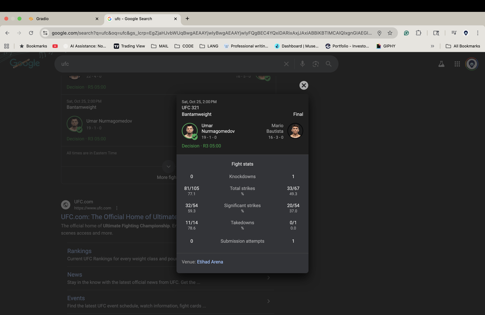
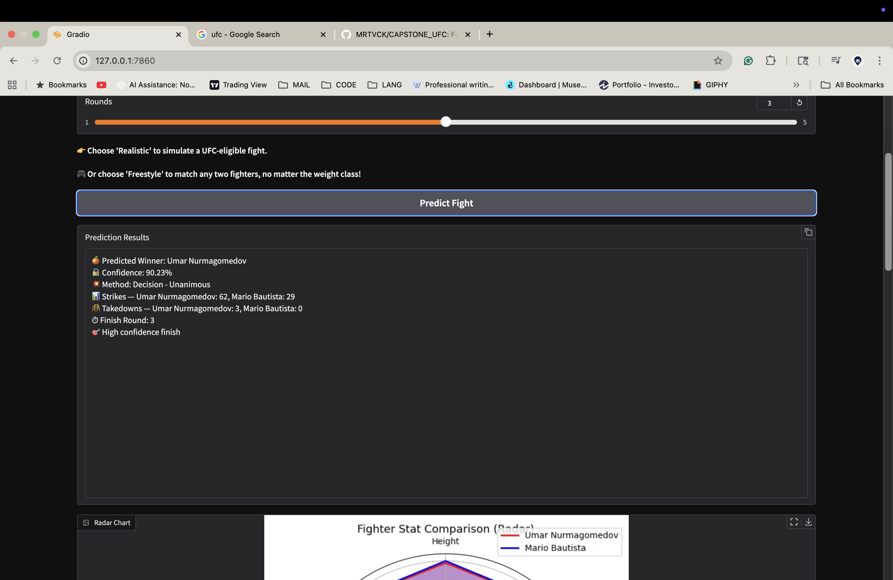
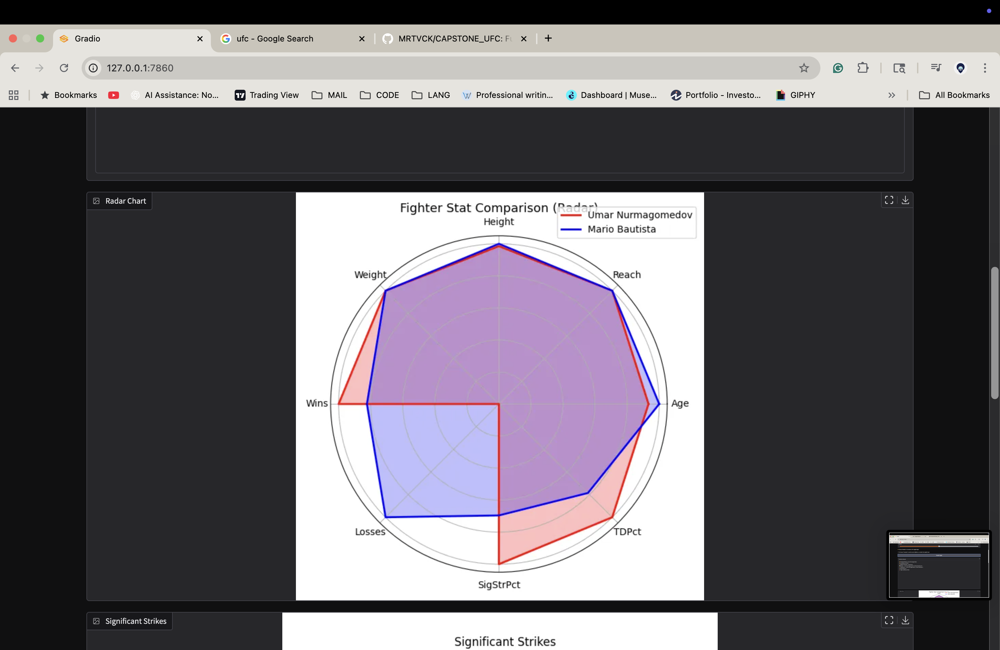
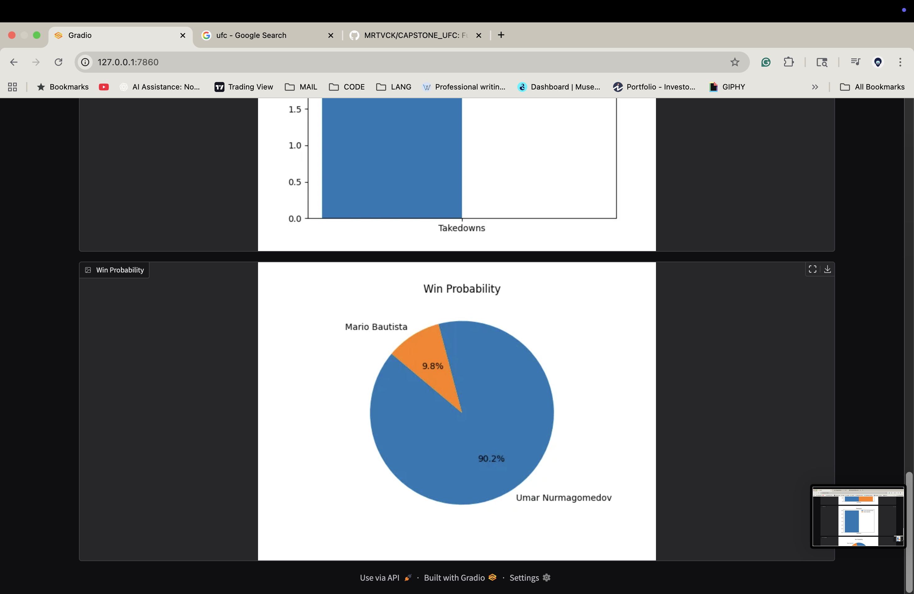

# 🥋 UFC Fight Prediction App

### 🎯 Overview
This project builds an **interactive machine learning app** that predicts UFC fight outcomes using real-world data from 1996–2024.

The app provides **data-driven forecasts** for:
- 🏆 **Winner Prediction** (Red vs Blue corner)  
- ⏱ **Expected Fight Duration** (rounds or minutes)  
- 💥 **Significant Strikes per fighter**  
- 🤼 **Takedowns per fighter**  
- 🧩 **Method of Victory** (KO/TKO, Submission, Decision)

Built with **Python, Scikit-learn, and Gradio**, it demonstrates how data analytics and machine learning can model complex combat-sports outcomes.  
The app successfully predicted several real bouts, including **Umar Nurmagomedov vs Mario Bautista (2025)**.

---

### ⚙️ Tech Stack
- **Python** (pandas • numpy • scikit-learn)  
- **Gradio** – interactive web interface  
- **Matplotlib** – data visualization  
- **Joblib** – model serialization  
- **Random Forest Classifier / Regressor**

---

### 🧠 Machine Learning Pipeline

| Stage | Description |
|-------|--------------|
| **Data Source** | `large_dataset.csv` — compiled from a **custom UFC Stats web scraper** combining 1996–2024 fight data |
| **Feature Engineering** | Reach, height, weight, age, strike accuracy, takedown accuracy, win types, fight record differences |
| **Winner Model** | RandomForestClassifier |
| **Duration & Strike Models** | RandomForestRegressor (per-corner predictions) |
| **Victory Method Model** | RandomForestClassifier |
| **Scaling/Encoding** | StandardScaler + LabelEncoder |
| **Interface** | Interactive Gradio UI for fighter vs fighter comparison |

---

### 📊 Model Performance (Winner Prediction)

| Metric | Score |
|--------|-------|
| **Accuracy** | 0.72 |
| **Precision (Red)** | 0.73 |
| **Recall (Red)** | 0.85 |
| **F1 (Red)** | 0.79 |
| **Cross-Validated Accuracy** | 0.70 ± 0.01 |

✅ **Real-world validation:** accurately predicted *Umar Nurmagomedov vs Mario Bautista (2025)*.

---

### 🧩 Real-World Validation Example

Below are screenshots comparing **the model’s prediction** vs **the official UFC result** for *Umar Nurmagomedov vs Mario Bautista (UFC 321)*:

| Model Prediction | Official Result |
|------------------|------------------|
| ✅ Winner: Umar Nurmagomedov | ✅ Winner: Umar Nurmagomedov |
| 🧠 Method: Decision (Unanimous) | 🧠 Method: Decision (Unanimous) |
| ⏱ Finish Round: 3 | ⏱ Finish Round: 3 |

The model achieved **a perfect prediction** — matching the winner, round, and fight method exactly.

#### Screenshots:




---

### 🎮 App Preview
> Select two fighters → App predicts → Displays:
- Predicted winner  
- Expected rounds & fight duration  
- Predicted strikes and takedowns per fighter  
- Method of victory + probabilities  
- Visual chart (Matplotlib)

---

### 🧰 Installation & Usage
```bash
1️⃣ Clone the repository
git clone https://github.com/MRTVCK/ufc-fight-predictor-ml-app.git
cd ufc-fight-predictor-ml-app

2️⃣ Create a virtual environment and install dependencies
python3 -m venv venv
source venv/bin/activate  # macOS/Linux
venv\Scripts\activate     # Windows
pip install -r requirements.txt

3️⃣ Run the app
python app.py

4️⃣ Open in browser
http://127.0.0.1:7860/
